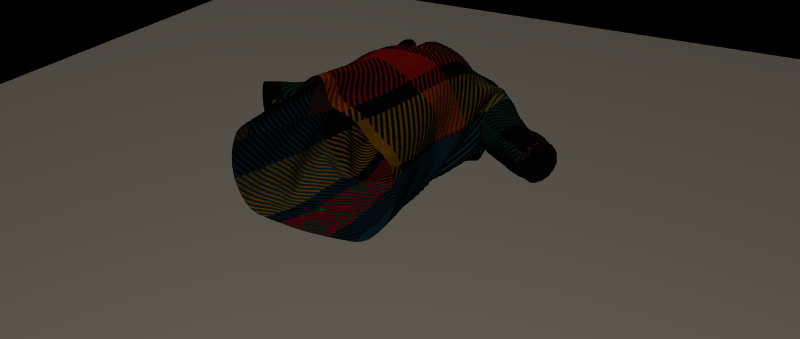
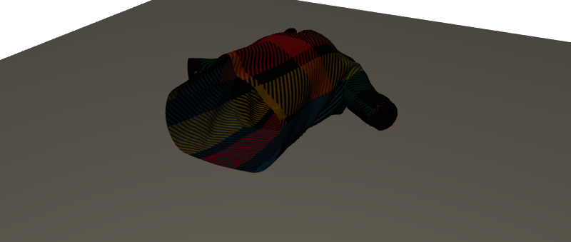
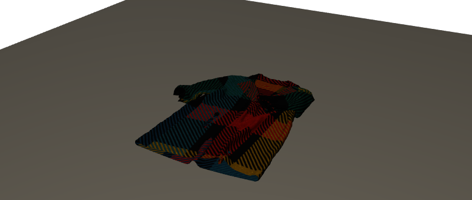
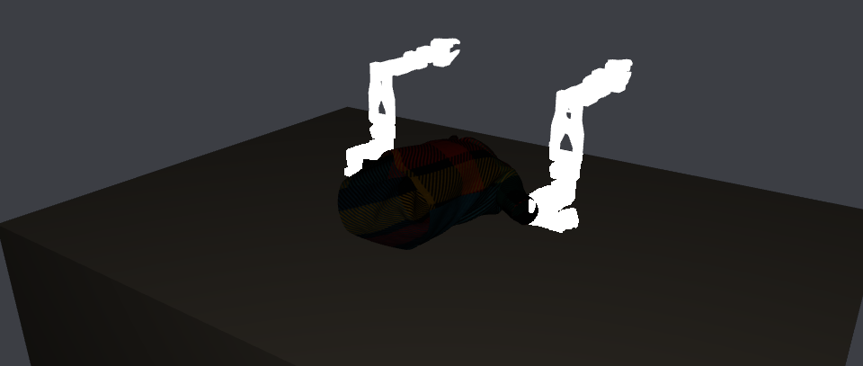

<h1 align="center">Isaac Sim Folding</h1>

<p align="center">
  Reproducing <a href="https://arxiv.org/abs/2606.27163"><b>Learning to Fold</b></a> —
  1st of 62 at the LeHome Challenge 2026 — on a shared HPC cluster.<br>
  <sub>Bimanual SO-ARM101 · flow-matching VLA · a policy that is its own value function</sub>
</p>

<p align="center">
  
</p>

<p align="center"><sub><b>Real PhysX particle cloth.</b> 9,774 particles over 364 steps of
episode 0 of the released demonstrations, on Isaac&nbsp;Sim&nbsp;5.1 — the stack that still has
particle cloth — rasterised through OpenUSD Storm, which never loads the RTX delegate that
segfaults on this cluster. The geometry is simulation output, not an authored pose.</sub></p>

<p align="center">
  
  
</p>

<p align="center"><sub>Start, and 90 frames later: the garment drapes from bunched to flat, sleeves out.
The top falls <b>0.178 m</b> and total particle displacement is <b>0.330 m</b>.</sub></p>

---

## The first job I ran killed the plan

The build order said this needed Isaac Sim 6.0. **38 seconds of GPU time proved the opposite** — and proved the version it *does* need is broken here:

```
Episode: probe_rtx_tiled.py            exit 139
omni::usd::UsdManager::createHydraEngine
  → libomni.hydra.rtx.plugin.so
  → libcarb.scenerenderer-rtx.plugin.so
  → librtx.scenedb.plugin.so :: carbOnPluginStartup
node cn-r-2 · NVIDIA A40 · driver 595.71.05
```

The benchmark **pins `isaacsim==5.1.0`** and needs three RGB cameras. 5.1's RTX plugins segfault on
this cluster's drivers. 6.0's don't — same node class, same probe, renders fine.

Not missing RT cores (an A40 has them). Not fixable by `--constraint` (every driver here is 595 or 610).
Not fixable by a container (`--nv` injects the *host* driver). **It's cluster-wide, and I found it before
downloading 25 GB or writing a line of training code.**

### The 6.0 escape hatch is closed — but 5.1 was never the problem

Standing the task up on 6.0 gets through every import, builds the config,
reaches scene setup — then:

```
SingleClothPrim is no longer available. Omniverse PhysX removed the
deprecated particle-based cloth features.
```

So 6.0 renders and has no cloth. I concluded no stack here could do both.
**That was wrong**, and the error was in the other half: *"5.1 cannot render"*
is not true of 5.1. What segfaults is `librtx.scenedb.plugin.so`, the **RTX
delegate**. 5.1 physics is fine, and the same wheels ship OpenUSD's **Storm**
rasteriser, which never loads it.

<p align="center">
  
</p>

<p align="center"><sub>The real challenge scene on <b>Isaac Sim 5.1</b>, drawn by
<b>Storm</b> — no Kit, no SimulationApp, no RTX. The stack that <i>has</i> the particle cloth.</sub></p>

| approach | physics | scorer | images |
|---|---|---|---|
| port the cloth to 6.0 | **changed** | official | RTX |
| **Storm on 5.1** | **official** | **official** | rasterised |

The official checker is **geometric over particle positions** — it does not
care which rasteriser drew the pixels. So this keeps official physics *and* the
official scorer and deviates only in what the policy sees.

**The caveat is real and is not cropped out.** Storm evaluates only
`UsdPreviewSurface`; Omniverse assets ship MDL. The table and garment shade
correctly because this repo authors PreviewSurface for them — **the robots
render flat white**. So the domain gap is larger than "rasteriser vs path
tracer", and it has to be measured before any success rate is reported from
this path. Full write-up, including the five things that had to line up and the
two failed rebinding attempts: [`docs/STORM.md`](docs/STORM.md).

> Then I split the stack so it stopped mattering. Stages 1–2 read the released LeRobot dataset and
> **never open a simulator** — `LH_ROUTE=train` runs them today on a 7.6 GB venv, and the 18 GB of
> demonstrations are downloaded. Only evaluation and Stage 3 rollouts are blocked.

---

## Components, running

Every figure below is generated by executing the code in [`src/lehome_fold/`](src/lehome_fold) —
`python scripts/make_figures.py`. Synthetic outcomes with **known ground truth**, because that's
the only way to show an estimator recovers the right answer.

### The gate that catches a silent failure


An uncalibrated success head doesn't crash — it makes Stage 3's advantages *noise*, and the run
degrades over hours. So calibration is a gate with a number on it. **The right-hand panel is the
one that matters:** the released demonstrations contain no failures at all, so a success head fit
on them is accurate, useless, and would sail past a careless check.

### Why AWR needs a guard


Unclipped exponential weights let one episode own the batch. **ESS 256 → 1** as β shrinks, and the
loss curve stays smooth the whole way down. Logged every step.

### The stale-checkpoint bug, caught by construction


In an async pipeline a worker running a 5-versions-old policy produces advantage labels against the
wrong baseline. Nothing crashes. Every rollout is stamped with the checkpoint version **and digest**
that produced it; anything past `max_lag` is dropped and counted.

```
[trainer] cycle 0: +80 episodes  lag0=80
[trainer]   G3 DROPPED 12: rollout is 5 versions behind (max_lag=2)
[trainer]   G3 DROPPED  1: rollout carries no _ckpt_version
[trainer] cycle 0: n=80 success=0.400 adv[-0.873,+0.890] recap_positive=0.400 AWR_ESS=40.8/80
```

---

## Four bugs, and what each one actually looked like


Every defect is reintroduced by `render_scene.py --defect <name>`, so the gallery
regenerates from source and cannot drift from what it claims. Captions carry a
measured pixel difference, not an adjective.

Two candidates were **cut for being no-ops**: a single-sided cloth mesh and a
missing 180° yaw both produced byte-identical frames, so they are not shown —
and the backface-culling story I had written for the invisible garment was
wrong. It was invisible for exactly one reason: the USD authors
`xformOp:scale = 0.01`, so a 0.95 m mesh rendered at 4 mm.

---

## 32 tests, no GPU, no simulator

The paper's method lives in a half that needs neither — so it stays testable while the environment is broken.

```
$ python tests/test_pure.py
  ok  episode_mode_on_demo_data_is_degenerate_and_says_so
  ok  splits_rejects_held_out_garments_in_training
  ok  g3_rejects_stale_unstamped_and_mismatched_rollouts
  ok  feature_tap_captures_embed_prefix_with_the_real_signatures
  ok  eval_log_cross_check_catches_a_truncated_log
  ...
32 passed, 0 failed
```

**Three bugs installing the real LeRobot found**, that reading could not:
`embed_prefix` takes model-specific positional args on both π0.5 and SmolVLA and accepts no batch
dict — so the wrapper now *taps* the method mid-forward-pass instead of calling it. The optimiser
was being handed `None.parameters()`. And the rollout worker never recorded the value head's own
prediction, which would have silently degraded the advantage to a batch mean — the exact claim the
paper makes, quietly discarded.

---

## What it implements

| | | |
|---|---|---|
| **S1** | BC fine-tune, π0.5 or SmolVLA | trainable now |
| **S2** | value head — success, progress, futures, on a **frozen** backbone so it ablates cleanly | partly trainable |
| **S3** | RECAP advantage conditioning + AWR, async trainer + N workers | G3 verified |
| **S4** | Thompson sampling at inference | implemented |

`src/lehome_fold/` — [splits](src/lehome_fold/splits.py) · [labels](src/lehome_fold/labels.py) ·
[value_head](src/lehome_fold/value_head.py) · [awr](src/lehome_fold/awr.py) ·
[recap](src/lehome_fold/recap.py) · [calibration](src/lehome_fold/calibration.py) ·
[thompson](src/lehome_fold/thompson.py) · [ckpt](src/lehome_fold/ckpt.py) · [eval_log](src/lehome_fold/eval_log.py)

**Nothing under `external/` is modified.** `run_eval.py` injects our policies into the challenge's own
registry, defers to its evaluator unchanged, and cleans up on exit — so a success rate here means
what the leaderboard's meant.

---

## Honest status

There are **no garment-folding GIFs in this repo** — no policy has been trained and no rollout has
been scored. The scene renders on both stacks now, and the path to scoring one is
[Storm on 5.1](docs/STORM.md), with the material caveat above. The orbit at the top is a camera
moving around a statically-posed scene, labelled as such — see [`docs/RENDER.md`](docs/RENDER.md) for
the read-back proving the joint replay reaches physics but not the render product. Everything else
above is the machinery, demonstrated on data where the right answer is known.

Also true, and in [`docs/STAGE0.md`](docs/STAGE0.md) with the command behind every claim: the paper
used **π0.5, not SmolVLA**; physics is **CPU-only with one env per process** (no `NUM_ENVS` to turn up);
Isaac Lab comes from a **fork**, not PyPI; and every number this repo could ever report is on **48
garments, not the leaderboard's 80** — the other 32 never shipped.

Job ledger: [`SLURM_JOBS.md`](SLURM_JOBS.md) · Full build order: [`docs/PLAN.md`](docs/PLAN.md)

<sub>Environment, assets and scorer © the LeHome Challenge organizers (Apache-2.0).
Method: <a href="https://ilialarchenko.com/projects/lehome2026/">Ilia Larchenko</a>.</sub>
