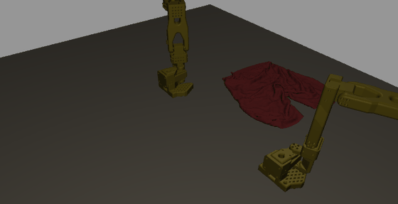
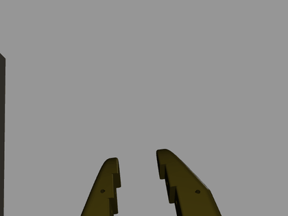

<h1 align="center">Isaac Sim Folding</h1>

**Update — 24 September 2026, matched comparison (v5):** the v4 candidate and the baseline were re-measured side by side in the same Slurm arrays on the same 16 development rows, two runs each. H10 **8/16 vs 5/16** (margin 3, one-sided Fisher p = 0.24), H50 **7/16 vs 7/16** — **no improvement under the preregistered rule**; the baseline is retained. The matched baseline is far above the earlier cross-campaign numbers, so most of v4's apparent gap was baseline variance between campaigns. 27 settled successful folds are recorded with hashes: [v5 report](campaigns/20260924-matched-comparison-v5/REPORT.md) · [gallery](campaigns/20260924-matched-comparison-v5/gallery.html).

**Earlier — 24 September 2026:** closed-loop fine-tuning campaigns v2–v4 are complete, and **no checkpoint met the preregistered improvement rule**; the baseline is retained. The best candidate reached **8/16** settled folds at H10 against the baseline's **2/16** (p = 0.027) but **3/8 vs 4/8** at H50, missing non-regression by one episode. Along the way: an optimizer defect that froze ~88% of trainable parameters in every earlier fine-tune was found and repaired, and 81/384 simulator-validated recovery continuations were produced. Baselines were measured in earlier campaigns; a same-wave comparison is the proposed next step. [v4 report](campaigns/20260923-recovery-supervision-v4/REPORT.md).

**Earlier update — 21 September 2026:** the v4 folding smoke gate finished **3/5 passed**, with two setup errors and no successful folds among the three valid short-budget episodes. The garment-switch diagnostic completed without reproducing the historical hang. A remaining unwelded-mesh integration guard is repaired; 16 CPU tests pass and replacement GPU smokes are submitted. The 24-rollout horizon pilot has not run. [Verified results, four-class policy footage, repairs and next steps](docs/FOLDING_STATUS_2026-09-21.md).

**Current measured status — 20 September 2026:** the strict short-pants
evaluation recorded **8/24** checker successes for the historical raster-adapted
baseline and **3/24** for new adaptation seed 1. Only **5 of 12** policy/class
evaluation cells completed; the other seven failed or timed out. The two new
adaptations have **not demonstrated an improvement**. These counts use the
official checker's ever-triggered success, not an independently rechecked final
settled fold. [Protocol, complete table and failure diagnosis](https://github.com/joses2017smjh/bhl-robustness-ladder/blob/main/docs/CLOTH_FOLDING_WEEKEND.md#measured-status-20-september-2026).

**Policy demos and both arm cameras:** [captioned gallery and provenance](https://github.com/joses2017smjh/bhl-robustness-ladder/blob/main/docs/FOLDING_MEDIA.md).

| Recording | Scope |
|---|---|
| [Historical policy success](https://github.com/joses2017smjh/bhl-robustness-ladder/blob/main/docs/gifs/folding-policy-success.gif) · [historical failure](https://github.com/joses2017smjh/bhl-robustness-ladder/blob/main/docs/gifs/folding-policy-failure.gif) | Earlier checkpoint, selected short-pants development poses; not either new adaptation |
| [New seed-0 policy failure](https://github.com/joses2017smjh/bhl-robustness-ladder/blob/main/docs/gifs/folding-adapted-failure.gif) | Short-sleeve top; 600 completed actions, checker never passed |
| [Left wrist](https://github.com/joses2017smjh/bhl-robustness-ladder/blob/main/docs/gifs/folding-adapted-left-wrist.gif) · [right wrist](https://github.com/joses2017smjh/bhl-robustness-ladder/blob/main/docs/gifs/folding-adapted-right-wrist.gif) | Both actual camera views from that same new failed episode |

The [replacement media gate](docs/MEDIA_GATE_2026-09-20.md) passed
rendering validation: 600 actions, 601 validated render calls and all four
outputs. **The fold failed**. [Compact failure video](docs/demo/adapt-s0-failure.mp4).
Selected clips illustrate behavior; they do not establish a success rate or a
controlled comparison between checkpoint generations. The record below follows
the earlier development sequence and is superseded by the current table above.

<p align="center">
Bimanual garment folding in Isaac Sim, scored by the LeHome challenge's own checker.
</p>

<p align="center">
  
</p>

<p align="center"><sub><b>Historical raster-adapted policy, closed-loop, scored
<code>Success ✓</code> by the challenge's own <code>success_checker_garment_fold</code>.</b>
No demonstration actions — the policy reads three rasterised camera views and emits joint targets.
This is an earlier checkpoint, not either new adaptation. Success is latched
when the checker passes; it does not establish a stable final fold.<br>
The earlier selected-pose study reported 2 of 8 short-pants poses and 0 of 4
across the other three classes. The newer matched evaluation is reported above.
The development path included a measured renderer-domain gap, 18,200 rasterised
training frames and unfreezing the action decoder.</sub></p>

<table align="center">
<tr>
<td align="center"><b>Top, long sleeve</b></td>
<td align="center"><b>Top, short sleeve</b></td>
<td align="center"><b>Pants, short</b></td>
<td align="center"><b>Pants, long</b></td>
</tr>
<tr>
<td></td>
<td></td>
<td></td>
<td></td>
</tr>
</table>

<p align="center"><sub><b>Historical demonstration replays, not policy rollouts.</b> All four garment classes. Each has its own fold criteria — a short top must
satisfy <code>[9.45, 12.15, 9.0, 13.05, 8.55]</code>, a long top
<code>[11.7, 10.8, 10.8, 9.9, 9.0]</code> — so passing one says nothing about the others.</sub></p>

### Historical wrist-camera examples

<table align="center">
<tr>
<td align="center"><b>Left wrist</b></td>
<td align="center"><b>Right wrist</b></td>
<td align="center"><b>The headline fold, from the gripper</b></td>
</tr>
<tr>
<td></td>
<td></td>
<td></td>
</tr>
</table>

<p align="center"><sub>The third is the same run as the GIF at the top of this page — what
the policy itself saw while earning its 5/5. These ride the grippers, matching the challenge rig
(<code>/Left_Robot/gripper/left_wrist_camera</code>, offset <code>(-0.001, 0.1, -0.04)</code>).
Two of the policy's three inputs. They were previously pinned to fixed world poses aimed 0.37 m from
the garment and rendered empty table — 14% of pixels changed between first and last frame but
<b>0.00%</b> by more than 60. After the fix: <b>13.1%</b> and <b>17.4%</b>.</sub></p>

### Historical failure modes

<table align="center">
<tr>
<td align="center"><b>Replay drifts — 3/5 conditions</b></td>
<td align="center"><b>Trained policy — never touches the cloth</b></td>
</tr>
<tr>
<td></td>
<td></td>
</tr>
</table>

<p align="center"><sub>Left: open-loop replay runs a recorded action sequence at a cloth that
diverges from the recording. Right: the trained policy hovers 12–14 cm above a garment resting at
0.529 m and never closes. <a href="#why-the-policy-fails">Measured cause below.</a></sub></p>

---

## Quickstart

The dependency-light half runs anywhere. No GPU, no simulator, no Isaac Sim.

```bash
git clone https://github.com/joses2017smjh/IsaacSimFolding.git
cd IsaacSimFolding
pip install -r requirements.txt
PYTHONPATH=src python tests/test_pure.py     # CPU-only assertions
python scripts/make_figures.py               # regenerates docs/img/*.png
```

Run in CI on every push — [`.github/workflows/tests.yml`](.github/workflows/tests.yml).

Verified: `src/` and `tests/` import only `numpy` and `torch`. The suite uses plain asserts and a
20-line runner — no pytest, no fixtures, no config.

**The simulator half does not have a quickstart, and pretending otherwise would waste your time.**
It needs Isaac Sim 5.1 in an Apptainer image, the challenge's asset pack, and a Slurm cluster with
an A40 or better. Entry points are in [`slurm/`](slurm); every job's outcome and cause is in
[`SLURM_JOBS.md`](SLURM_JOBS.md).

## Architecture

```
                    ┌─────────────────── rollout loop, one step ───────────────────┐
                    │                                                              │
  LeHome env ──────►│  particle cloth (PhysX, GPU)     robot joint state           │
  (Isaac Sim 5.1)   │            │                            │                    │
                    │            └──────────┬─────────────────┘                    │
                    │                       ▼                                      │
                    │        StormObserver — 3 cameras, in-process                 │
                    │        top (on base) · left+right wrist (on grippers)        │
                    │                       │                                      │
                    │              3 × 640×480 RGB                                 │
                    │                       ▼                                      │
                    │        SmolVLA 450M ──► 12 joint targets (6 per arm)         │
                    │                       │                                      │
                    └───────────────────────┼──────────────────────────────────────┘
                                            ▼
                          success_checker_garment_fold  →  verdict
                                            │
                   ┌────────────────────────┴────────────────────────┐
                   ▼                                                 ▼
        results/rollout_*.json                          value head (0.76M params)
        GIF named by the verdict                        success · progress · future
                                                        gated by ECE ≤ 0.10
```

| component | file | what it does |
|---|---|---|
| Storm observer | [`src/lehome_fold/storm_obs.py`](src/lehome_fold/storm_obs.py) | Builds the USD stage once, re-renders 3 cameras per step. Bypasses the RTX delegate, which segfaults on this cluster. |
| Feature tap | [`src/lehome_fold/policy_wrap.py`](src/lehome_fold/policy_wrap.py) | Hooks `model.embed_prefix` mid-forward to read the VLA's prefix features without a second pass. |
| Value heads | [`src/lehome_fold/value_head.py`](src/lehome_fold/value_head.py) | Success, progress and future-state heads on frozen features. Masks frames with no scored outcome. |
| Outcome labels | [`src/lehome_fold/labels.py`](src/lehome_fold/labels.py) | `class_balance` flags all-success data as degenerate — which the demonstrations are. |
| Calibration | [`src/lehome_fold/calibration.py`](src/lehome_fold/calibration.py) | ECE/MCE/Brier and the G2 gate. |
| AWR | [`src/lehome_fold/awr.py`](src/lehome_fold/awr.py) | Advantage weights plus an effective-sample-size guard. |
| Rollout | [`scripts/render/policy_rollout51.py`](scripts/render/policy_rollout51.py) | The loop above. Emits a verdict only for episodes that actually ran. |

## Historical development results

The following tables preserve earlier development snapshots. Their different
checkpoints, pose selections and capture protocols must not be pooled with the
current strict evaluation. Verdicts come from the challenge's
`success_checker_garment_fold`; this checks geometry, not camera validity.
The separately reported old baseline result of 6/24 is invalid as a
correctly observed baseline because its policy received stale images after
23,250 swallowed rendering errors. See the [diagnosis](https://github.com/joses2017smjh/bhl-robustness-ladder/blob/main/docs/CLOTH_FOLDING_WEEKEND.md#what-failed-and-what-already-works).

| driver | episodes | folded |
|---|---|---|
| demonstration replay | 21 | **15** |
| trained BC policy | 16 | **0** |

| class | replays | folded |
|---|---|---|
| Top_Short | 11 | 8 |
| Top_Long | 4 | 3 |
| Pant_Short | 3 | 2 |
| Pant_Long | 3 | 2 |

<a name="why-the-policy-fails"></a>

### Why the original policy failed

Same policy, same states, only the renderer differs. Demonstration replay pins the state
trajectory, so this isolates perception from compounding closed-loop drift.

| checkpoint | path-traced (trained on) | Storm rasterised (rollouts) | gap |
|---|---|---|---|
| 15K steps | +0.966 | +0.063 | 0.902 |
| **30K, converged** | **+0.976** | **−0.038** | **1.014** |

These action-prediction measurements support a renderer-domain gap. They do
not by themselves establish closed-loop task mastery. The original policy
hovered 12–14 cm above the cloth, and fixing wrist-camera geometry alone did
not resolve its failure to act on the rasterised observations.

**Longer training alone did not close this measured gap.** Doubling the schedule improved
in-distribution skill (+0.966 → +0.976, MSE down 29%) and pushed Storm-frame skill *below* the
mean-action baseline (+0.063 → −0.038). The gap widened. A better-fit policy is more tightly tuned
to path-traced appearance statistics, so it transfers worse — more training deepens the overfit to
the renderer it saw.

<a name="known-issue-invisible-garments"></a>

### Fixed: invisible garments

11 of 33 recorded episodes rendered an empty table. The physics was fine — they folded and scored —
but the observer wrote the particle array straight into the mesh's `points`, and UV seams mean the
render mesh has **more** vertices than the solver has particles. Face indices then ran past the
point list and the mesh drew nothing.

```
Pant_Short_Seen_0  11,573 verts -> 11,385 unique  (= its particle count)   was blank
Top_Long_Seen_0    14,746 verts -> 14,544 unique                           was blank
Top_Short_Seen_1    9,774 verts ->  9,774 unique  (no seams)               rendered
Top_Long_Seen_1    10,410 verts -> 10,410 unique  (no seams)               rendered
```

It hid because the checker reads particle positions from physics and never looks at a pixel, so
every affected episode still produced a valid verdict — under a caption over an empty table.

[`storm_obs.py`](src/lehome_fold/storm_obs.py) now recovers the mapping by deduplicating rest
positions, and refuses to render if the unique count disagrees with the particle count or if the
result contains a 0.25 m edge. All affected episodes were re-recorded. **Every verdict came back identical** — 250 False, 251 True,
252 True, 501 True, 502 False, and all four policy rollouts `failure` — while garment pixels went from
0.00% to 11.6–19.5%. Same physics, same scores, now visible. All 38 published GIFs audited: none blank.

### Fine-tuning on rasterised frames: large effect, still no fold

The gap the measurement identified is closable. Capturing 3,200 `(Storm frame,
demonstration action-chunk)` pairs by replaying demonstrations in sim, then fine-tuning the vision
pathway on them (86.4M of 450M parameters, val loss 0.268 → 0.074):

| | 30K base | rasterised fine-tune |
|---|---|---|
| Storm-frame skill | **−0.038** | **+0.328** |
| cloth displacement | 0.0176 m | **0.2534 m** (14×) |
| `dist(p0,p4)` → 9.45 | 29.22 | **20.47** |
| `dist(p2,p3)` → 12.15 | 39.16 | **25.16** |
| `dist(p1,p5)` → 9.00 | 29.40 | **14.65** |
| verdict | failure | failure |

The policy went from not touching the cloth to genuinely manipulating it — fold distances roughly
halved and displacement rose 14-fold. On `Top_Long_Seen_1` it missed a condition by **0.19 cm**
(10.99 against a 10.80 threshold).

**Unfreezing the action decoder as well takes it further.** Same 16 episodes, additionally training
`lm_expert` (98.2M) and the action projections while the 350M language model stays frozen:

| | vision only | vision + action decoder |
|---|---|---|
| Storm-frame skill | +0.328 | **+0.803** |
| best rollout | 2/5 conditions | **4/5 conditions** |
| `dist(p0,p4)` → 9.45 | 20.47 | **3.78** ✓ |
| `dist(p1,p5)` → 9.00 | 14.65 | **6.82** ✓ |
| `dist(p2,p3)` → 12.15 | 25.16 | 43.08 ✗ |

Two folding conditions now pass by wide margins. The third fails because the policy pulls that pair
apart while folding the other two axes — a partial fold rather than a failure to act.

**And then it folded.** Scaling the capture to 91 episodes (18,200 frames, class-balanced) with the
decoder unfrozen produced the project's first policy successes.

The historical selected-pose study covered **eight recorded spawn poses of the
same class**. Its observed fraction is descriptive, not a generalization estimate:

| garment class | poses tried | folded |
|---|---|---|
| Pant_Short | 8 | **2 (25%)** |
| Top_Short | 2 | 0 |
| Top_Long | 1 | 0 |
| Pant_Long | 1 | 0 |

Failures are not flailing — they sit at 2/5 or 3/5 conditions with the cloth visibly manipulated.
The recorded successes passed all five conditions at some point during the
400-action rollout; the historical records do not establish terminal success.

| | 30K base | +raster 16ep vision | +raster 16ep v+a | **+raster 91ep v+a** |
|---|---|---|---|---|
| Storm skill | −0.038 | +0.328 | **+0.803** | +0.652 |
| best rollout | 2/5 | 2/5 | 4/5 | **5/5 — SUCCESS** |
| policy folds | 0/9 | 0/4 | 0/3 | **1/5** |

Note the shadow skill *fell* from +0.803 to +0.652 while the rollout result improved from 4/5 to a
success. Teacher-forced action prediction and closed-loop control are not the same objective, which
is the fourth time in this project a validation-style metric has pointed the wrong way.

**Earlier snapshot: 0 for 16.** At that stage every recorded success was a
demonstration replay; later raster-adapted checkpoints produced policy successes. Note
also that validation loss badly under-read this: 0.0739 → 0.0686, a 7% improvement, for a 0.475 gain
in Storm-frame skill and 2/5 → 4/5 conditions.

### Where it loses

- **Reliable folding remains unestablished.** The original 0/16 policy snapshot
  was followed by occasional raster-adapted short-pants successes. The strict
  September comparison did not demonstrate an improvement from the two new
  adaptations, and seven evaluation cells remained incomplete.
- **π0.5 — the paper's actual base model — does not run.** lerobot 0.4.3 probes for
  `transformers.models.siglip.check`, from a patched fork no declared extra installs.
- **BC training is complete**: 30,000 steps across four wall clocks, loss 1.505 → 0.056. It did not help: see above.
- **48 garments, not the leaderboard's 80.** The other 32 never shipped.
- **G2 passes at `ECE=0.0717`**, but `MCE=0.438`: the low-confidence bins hold 1–7 samples against
  199 in `[0.93, 1.00)`. Calibrated where the data is, not everywhere.
- **The 0.902 gap is single-step and teacher-forced.** It isolates perception, which is what it was
  built for. It is not a closed-loop success measurement.

### Other historical snapshot numbers

| | |
|---|---|
| Unit tests | 37, no GPU, no simulator |
| Cloth | 9,774 particles, PhysX GPU dynamics |
| Observations | 3 × 640×480, ~0.05 s/frame via Storm |
| Policy | SmolVLA 450M, chunk 50, 12-DoF absolute joint targets |
| Value head | 0.76M params on frozen 960-d features |
| Labelled frames | 6,066 from 20 scored episodes — 15 success / 5 failure |
| Slurm jobs run | 71, each with its cause recorded |

## What is implemented but not run

Components for stages 3 and 4 exist and have unit tests. These helpers and
orchestration code do not establish an end-to-end trained or validated
RECAP/AWR policy:

| stage | code | state |
|---|---|---|
| RECAP advantage conditioning | [`src/lehome_fold/recap.py`](src/lehome_fold/recap.py) | tested, unrun |
| AWR with an ESS guard | [`src/lehome_fold/awr.py`](src/lehome_fold/awr.py) | tested, unrun |
| Async trainer / rollout workers | [`scripts/trainer_loop.py`](scripts/trainer_loop.py), [`scripts/rollout_worker.py`](scripts/rollout_worker.py) | tested, unrun |
| Thompson sampling over checkpoints | [`src/lehome_fold/thompson.py`](src/lehome_fold/thompson.py) | tested, unrun |

The Storm camera shim unblocked the initial rendering path. The later stale-frame,
garment-switch and scorer failures show why that smoke result is not a complete
training or evaluation validation.

Both route through [`scripts/run_eval.py`](scripts/run_eval.py) into LeHome's own `scripts.eval`,
which was run with `--enable_cameras`. `AppLauncher` builds the Isaac&nbsp;Lab render product at
*launch* when that flag is set, and 5.1's RTX delegate segfaults against this driver — at
586&nbsp;ms, before any camera object exists. Replacing the camera class alone could never have
helped.

The fix is to drop the flag and serve pixels through a `TiledCamera`-shaped shim, because the
environment touches its cameras through only four things: construction, registration as a scene
sensor, `data.output["rgb"]`, and `data.output["depth"]`. Storm already produces those for every
rollout in this repo.

```
[storm_eval] TiledCamera -> Storm; _get_observations wrapped
[Success Check] Garment type: short-pant, Thresholds: [...]
[Success Check] Final result: Failed ✗
```

**Historical smoke: 12 episodes scored by the challenge's own checker, 0 render failures.**
This exercised the renderer/evaluator path, not stages 3 and 4 learning end to end:
[`storm_camera.py`](src/lehome_fold/storm_camera.py),
[`storm_eval.py`](src/lehome_fold/storm_eval.py), enabled with `LH_STORM_EVAL=1`.

Three limits, stated rather than left to be discovered: depth is synthetic (the checker reads
particle positions and never depth), cameras bind to views by construction order, and `pynput` is
stubbed because a headless compute node has no keyboard.

**π0.5, the paper's base model, does not run at all.** lerobot 0.4.3 probes for
`transformers.models.siglip.check`, a module from a patched transformers fork that no declared extra
installs. Forcing one risks the working SmolVLA pipeline everything else depends on, so it was not
attempted.

## Stack

- Isaac Sim 5.1.0 · Isaac Lab 2.3.2 (forked)
- PhysX particle cloth, GPU dynamics
- OpenUSD + Hydra Storm (rasteriser; the RTX delegate segfaults on this driver)
- LeRobot 0.4.3 · SmolVLA 450M · PyTorch 2.7 / CUDA 12.8
- Apptainer · Slurm
- numpy, plain-assert tests

---

<sub>Build narrative, failed approaches and the full diagnostic trail:
<a href="docs/README_long.md">docs/README_long.md</a> ·
<a href="SLURM_JOBS.md">SLURM_JOBS.md</a> ·
<a href="docs/PLAN.md">docs/PLAN.md</a><br>
Environment, assets and scorer © the LeHome Challenge organizers (Apache-2.0).
Method: <a href="https://ilialarchenko.com/projects/lehome2026/">Ilia Larchenko</a>.</sub>
