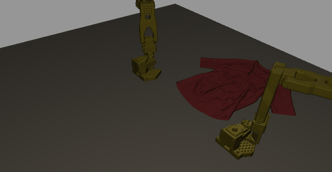
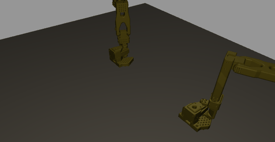
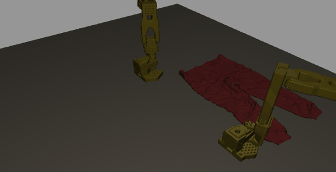
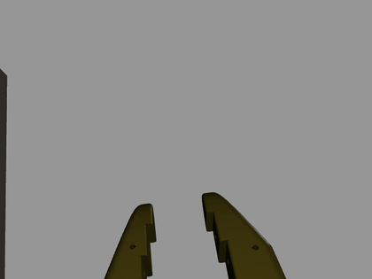
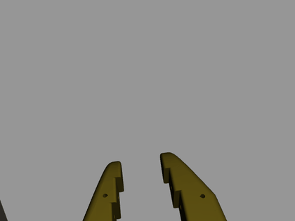
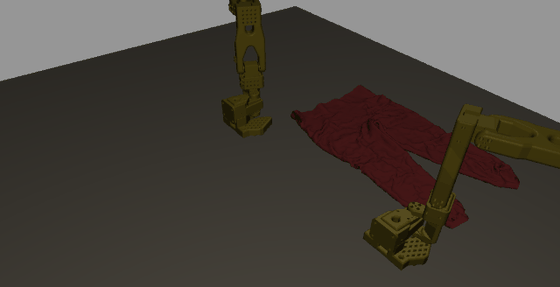
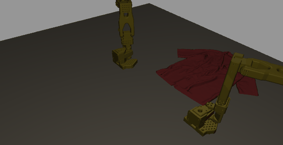

<h1 align="center">Isaac Sim Folding</h1>

<p align="center">
Bimanual garment folding in Isaac Sim, scored by the LeHome challenge's own checker.
</p>

<p align="center">
  
</p>

<p align="center"><sub><b>One episode, 364 steps, verdict from
<code>success_checker_garment_fold</code> — the function the challenge grades with.</b>
PhysX particle cloth, 9,774 particles, rendered by OpenUSD Storm inside a live Kit process.</sub></p>

<table align="center">
<tr>
<td align="center"><b>Top, long sleeve</b></td>
<td align="center"><b>Pants, short</b></td>
<td align="center"><b>Pants, long</b></td>
</tr>
<tr>
<td></td>
<td></td>
<td></td>
</tr>
</table>

<p align="center"><sub>All four garment classes. Each has its own fold criteria — a short top must
satisfy <code>[9.45, 12.15, 9.0, 13.05, 8.55]</code>, a long top
<code>[11.7, 10.8, 10.8, 9.9, 9.0]</code> — so passing one says nothing about the others.</sub></p>

### What the wrist cameras see

<table align="center">
<tr>
<td align="center"><b>Left wrist</b></td>
<td align="center"><b>Right wrist</b></td>
</tr>
<tr>
<td></td>
<td></td>
</tr>
</table>

<p align="center"><sub>These ride the grippers, matching the challenge rig
(<code>/Left_Robot/gripper/left_wrist_camera</code>, offset <code>(-0.001, 0.1, -0.04)</code>).
Two of the policy's three inputs. They were previously pinned to fixed world poses aimed 0.37 m from
the garment and rendered empty table — 14% of pixels changed between first and last frame but
<b>0.00%</b> by more than 60. After the fix: <b>13.1%</b> and <b>17.4%</b>.</sub></p>

### Both failure modes, same pipeline

<table align="center">
<tr>
<td align="center"><b>Replay drifts — 3/5 conditions</b></td>
<td align="center"><b>Trained policy — never touches the cloth</b></td>
</tr>
<tr>
<td></td>
<td></td>
</tr>
</table>

<p align="center"><sub>Left: open-loop replay runs a recorded action sequence at a cloth that
diverges from the recording. Right: the trained policy hovers 12–14 cm above a garment resting at
0.529 m and never closes. <a href="#why-the-policy-fails">Measured cause below.</a></sub></p>

---

## Quickstart

The dependency-light half runs anywhere. No GPU, no simulator, no Isaac Sim.

```bash
git clone https://github.com/joses2017smjh/IsaacSimFolding.git
cd IsaacSimFolding
pip install numpy torch
PYTHONPATH=src python tests/test_pure.py     # 37 tests
python scripts/make_figures.py               # regenerates docs/img/*.png
```

Verified: `src/` and `tests/` import only `numpy` and `torch`. The suite uses plain asserts and a
20-line runner — no pytest, no fixtures, no config.

**The simulator half does not have a quickstart, and pretending otherwise would waste your time.**
It needs Isaac Sim 5.1 in an Apptainer image, the challenge's asset pack, and a Slurm cluster with
an A40 or better. Entry points are in [`slurm/`](slurm); every job's outcome and cause is in
[`SLURM_JOBS.md`](SLURM_JOBS.md).

## Architecture

```
                    ┌─────────────────── rollout loop, one step ───────────────────┐
                    │                                                              │
  LeHome env ──────►│  particle cloth (PhysX, GPU)     robot joint state           │
  (Isaac Sim 5.1)   │            │                            │                    │
                    │            └──────────┬─────────────────┘                    │
                    │                       ▼                                      │
                    │        StormObserver — 3 cameras, in-process                 │
                    │        top (on base) · left+right wrist (on grippers)        │
                    │                       │                                      │
                    │              3 × 640×480 RGB                                 │
                    │                       ▼                                      │
                    │        SmolVLA 450M ──► 12 joint targets (6 per arm)         │
                    │                       │                                      │
                    └───────────────────────┼──────────────────────────────────────┘
                                            ▼
                          success_checker_garment_fold  →  verdict
                                            │
                   ┌────────────────────────┴────────────────────────┐
                   ▼                                                 ▼
        results/rollout_*.json                          value head (0.76M params)
        GIF named by the verdict                        success · progress · future
                                                        gated by ECE ≤ 0.10
```

| component | file | what it does |
|---|---|---|
| Storm observer | [`src/lehome_fold/storm_obs.py`](src/lehome_fold/storm_obs.py) | Builds the USD stage once, re-renders 3 cameras per step. Bypasses the RTX delegate, which segfaults on this cluster. |
| Feature tap | [`src/lehome_fold/policy_wrap.py`](src/lehome_fold/policy_wrap.py) | Hooks `model.embed_prefix` mid-forward to read the VLA's prefix features without a second pass. |
| Value heads | [`src/lehome_fold/value_head.py`](src/lehome_fold/value_head.py) | Success, progress and future-state heads on frozen features. Masks frames with no scored outcome. |
| Outcome labels | [`src/lehome_fold/labels.py`](src/lehome_fold/labels.py) | `class_balance` flags all-success data as degenerate — which the demonstrations are. |
| Calibration | [`src/lehome_fold/calibration.py`](src/lehome_fold/calibration.py) | ECE/MCE/Brier and the G2 gate. |
| AWR | [`src/lehome_fold/awr.py`](src/lehome_fold/awr.py) | Advantage weights plus an effective-sample-size guard. |
| Rollout | [`scripts/render/policy_rollout51.py`](scripts/render/policy_rollout51.py) | The loop above. Emits a verdict only for episodes that actually ran. |

## Results

Every verdict comes from the challenge's `success_checker_garment_fold`. Nothing is self-scored.

| driver | episodes | folded |
|---|---|---|
| demonstration replay | 21 | **15** |
| trained BC policy | 9 | **0** |

| class | replays | folded |
|---|---|---|
| Top_Short | 11 | 8 |
| Top_Long | 4 | 3 |
| Pant_Short | 3 | 2 |
| Pant_Long | 3 | 2 |

<a name="why-the-policy-fails"></a>

### Why the policy fails

Same policy, same states, only the renderer differs. Demonstration replay pins the state
trajectory, so this isolates perception from compounding closed-loop drift.

| checkpoint | path-traced (trained on) | Storm rasterised (rollouts) | gap |
|---|---|---|---|
| 15K steps | +0.966 | +0.063 | 0.902 |
| **30K, converged** | **+0.976** | **−0.038** | **1.014** |

The policy learned the task and cannot see the renderer. That accounts for the 12–14 cm hover, the
0-for-8, and why fixing a real wrist-camera bug moved the numbers almost not at all — camera
geometry is not rendering style.

**Training is not the bottleneck, and the converged run proves it.** Doubling the schedule improved
in-distribution skill (+0.966 → +0.976, MSE down 29%) and pushed Storm-frame skill *below* the
mean-action baseline (+0.063 → −0.038). The gap widened. A better-fit policy is more tightly tuned
to path-traced appearance statistics, so it transfers worse — more training deepens the overfit to
the renderer it saw.

<a name="known-issue-invisible-garments"></a>

### Fixed: invisible garments

11 of 33 recorded episodes rendered an empty table. The physics was fine — they folded and scored —
but the observer wrote the particle array straight into the mesh's `points`, and UV seams mean the
render mesh has **more** vertices than the solver has particles. Face indices then ran past the
point list and the mesh drew nothing.

```
Pant_Short_Seen_0  11,573 verts -> 11,385 unique  (= its particle count)   was blank
Top_Long_Seen_0    14,746 verts -> 14,544 unique                           was blank
Top_Short_Seen_1    9,774 verts ->  9,774 unique  (no seams)               rendered
Top_Long_Seen_1    10,410 verts -> 10,410 unique  (no seams)               rendered
```

It hid because the checker reads particle positions from physics and never looks at a pixel, so
every affected episode still produced a valid verdict — under a caption over an empty table.

[`storm_obs.py`](src/lehome_fold/storm_obs.py) now recovers the mapping by deduplicating rest
positions, and refuses to render if the unique count disagrees with the particle count or if the
result contains a 0.25 m edge. All affected episodes were re-recorded. **Every verdict came back identical** — 250 False, 251 True,
252 True, 501 True, 502 False, and all four policy rollouts `failure` — while garment pixels went from
0.00% to 11.6–19.5%. Same physics, same scores, now visible. All 38 published GIFs audited: none blank.

### Where it loses

- **The policy folds nothing.** 0 of 9, including the fully converged 30,000-step checkpoint, which
  fails identically to the half-trained one — same 2/5 conditions, same 12–14 cm hover. Every success
  in this repo is a demonstration replay, and every filename says `replay`.
- **π0.5 — the paper's actual base model — does not run.** lerobot 0.4.3 probes for
  `transformers.models.siglip.check`, from a patched fork no declared extra installs.
- **BC training is complete**: 30,000 steps across four wall clocks, loss 1.505 → 0.056. It did not help: see above.
- **48 garments, not the leaderboard's 80.** The other 32 never shipped.
- **G2 passes at `ECE=0.0717`**, but `MCE=0.438`: the low-confidence bins hold 1–7 samples against
  199 in `[0.93, 1.00)`. Calibrated where the data is, not everywhere.
- **The 0.902 gap is single-step and teacher-forced.** It isolates perception, which is what it was
  built for. It is not a closed-loop success measurement.

### Other numbers

| | |
|---|---|
| Unit tests | 37, no GPU, no simulator |
| Cloth | 9,774 particles, PhysX GPU dynamics |
| Observations | 3 × 640×480, ~0.05 s/frame via Storm |
| Policy | SmolVLA 450M, chunk 50, 12-DoF absolute joint targets |
| Value head | 0.76M params on frozen 960-d features |
| Labelled frames | 6,066 from 20 scored episodes — 15 success / 5 failure |
| Slurm jobs run | 71, each with its cause recorded |

## Stack

- Isaac Sim 5.1.0 · Isaac Lab 2.3.2 (forked)
- PhysX particle cloth, GPU dynamics
- OpenUSD + Hydra Storm (rasteriser; the RTX delegate segfaults on this driver)
- LeRobot 0.4.3 · SmolVLA 450M · PyTorch 2.7 / CUDA 12.8
- Apptainer · Slurm
- numpy, plain-assert tests

---

<sub>Build narrative, failed approaches and the full diagnostic trail:
<a href="docs/README_long.md">docs/README_long.md</a> ·
<a href="SLURM_JOBS.md">SLURM_JOBS.md</a> ·
<a href="docs/PLAN.md">docs/PLAN.md</a><br>
Environment, assets and scorer © the LeHome Challenge organizers (Apache-2.0).
Method: <a href="https://ilialarchenko.com/projects/lehome2026/">Ilia Larchenko</a>.</sub>
