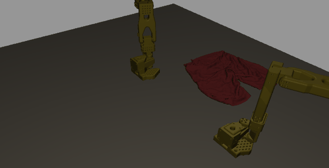
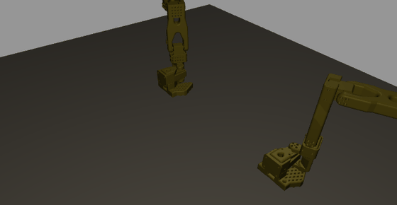
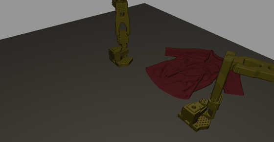
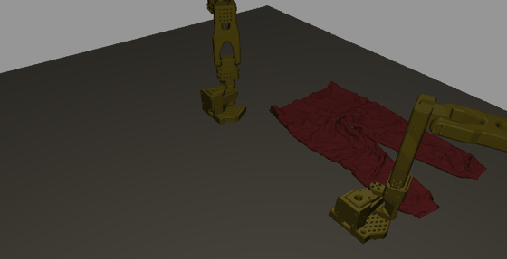
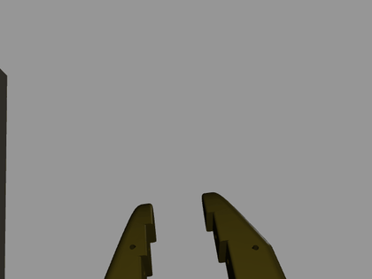
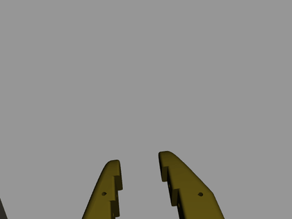
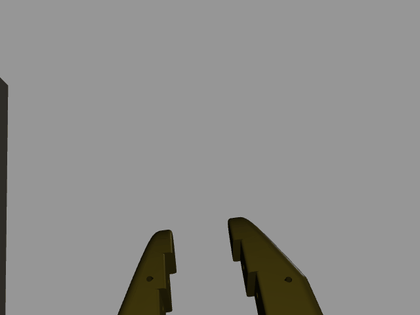
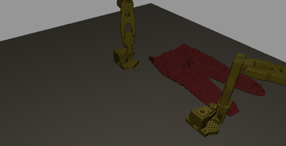
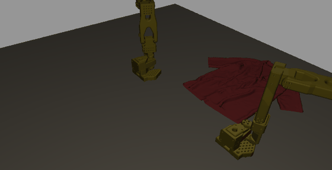

<h1 align="center">Isaac Sim Folding</h1>

## Current status (27 September 2026, after campaign v8)

**Deliverable: the untouched baseline**, the raster fine-tune `bc_smolvla_raster_ft_full` (`model.safetensors` `4a37d4dc…`, pinned `immutable: true` in every campaign manifest). Nine fine-tuned checkpoints from campaigns v2–v8 have been scored on the development rows. None passed its preregistered rule. The confirmatory final set has never been spent.

**Latest: v8, a one-factor anchor diagnostic** ([status](campaigns/20260926-anchor-diagnostic-v8/STATUS.md) · [report](campaigns/20260926-anchor-diagnostic-v8/REPORT.md) · [manifest](campaigns/20260926-anchor-diagnostic-v8/manifest.json)). v7 traced every fine-tune's H50 deficit to a shared early-episode shift and named the behaviour-cloning anchor (12 tops + 4 pants) as the suspect. v8 replaced that anchor with 16 pants demonstrations (8 Pant_Short + 8 Pant_Long) and kept everything else the same:
- v7's 6,375-label corpus, byte for byte;
- lr 3.3e-6, batch 4 × grad-accum 8, fp32 master weights, 300 steps;
- the latest checkpoint that passes the retention guard.

The anchor's source also moved, from `storm_capture` to `storm_capture100` (the baseline's own raster capture). The effect of the source cannot be separated from the effect of the composition.

| preregistered check | `an1-step000300` vs baseline, same Slurm arrays | result |
|---|---|---|
| mechanistic endpoints (read before the counts) | first H50 chunk opens only the right gripper: 0/16 vs 2/16 episodes; dev03 cloth lift by action 150: 0.117 m vs 0.117 m | supported |
| retention guard (≤ 1.10 × baseline) | 0.0771 vs 0.0714 (1.08×) | pass |
| reload, fit gate | reload ok; paired diff 0.00066, 95% CI [−0.0022, 0.0032] | pass |
| H10, pooled over 2 runs | **9/16 vs 2/16**, margin 7, one-sided Fisher p = 0.0117 | pass (first pass in a matched comparison) |
| H50, pooled over 2 runs | **6/16 vs 8/16** | **fail** (non-regression) |
| validity | 64/64 episodes, 600 actions + 60-step settle | pass |

Per pose (settled / reached / episodes; reached is counted from the per-step geometric trace):

| | baseline H10 | an1 H10 | baseline H50 | an1 H50 |
|---|---|---|---|---|
| P_A (dev00/04/06) | 0/0/6 | 5/5/6 | 0/0/6 | 0/2/6 |
| P_B (dev01/03) | 0/0/4 | 1/2/4 | 4/4/4 | 2/2/4 |
| P_C (dev02/05/07) | 2/4/6 | 3/4/6 | 4/4/6 | 4/4/6 |

**Outcome: not improved.** The development screen failed. Under the preregistration the baseline stays the deliverable and the final set stays unspent. The whole H50 deficit is one row, dev01 H50: baseline 2/2, an1 0/2. v8 used 67 GPU tasks (4.64 GPU-hours). All five stage jobs completed, and nothing needs rerunning.

**How to read the H10 pass.** It is probably a real behavioural difference on these eight rows, but it is not robust:
- **It survives stratification.** By row p = 0.012, by pose 0.011, by row × GPU model 0.010 (9/15 vs 1/13). Treating rows as the unit gives 0.047–0.10.
- **Two P_A rows carry most of it.** dev04 and dev06 supply +4 of the +7 margin, and dropping either one gives p = 0.052.
  - dev04 is robust: the baseline has settled it 0/10, on both GPU models.
  - At dev06 the baseline fails only on NVIDIA A40 (0/6, against 4/4 on Quadro RTX 8000), and all v8 dev06 runs were on A40.
- **Some of the gain is thin, and one row regressed.** 4 of the 9 candidate wins end within 1 cm of the threshold. At dev05, an1 settled 0/2, where a2, pb1 and dq1 had settled 8/8 on both GPU models.
- **The baseline drew low.** Its 2/16 is its lowest matched H10 score (5, 5, 3, 2 over v5–v8, on identical seeds).
- **A rerun would probably fail.** A matched rerun would pass the H10 clause about 35–45% of the time if hardware is ignored, and 18–52% depending on the GPU mix the scheduler assigns. It would pass the full rule 10–20% of the time.
- **The gain is at the wrong horizon for shipping.** Checkpoints ship at H50: `n_action_steps = 50`, and the challenge loader applies no override. At H50, an1 scores 6/16 vs 8/16.

**Running now: v9, a fresh-seed re-measurement with the GPU model pinned.** It is measurement only: the baseline and an1 run on 48 fresh-seed development rows. The A40 block is primary and the RTX 8000 block is secondary; both are queued behind cluster maintenance. The final set stays untouched and the baseline stays the deliverable. See the [v9 status](campaigns/20260928-fresh-seed-remeasure-v9/STATUS.md) and the [pending tasks and stretch goals](PENDING.md).

**Campaign reports:**
- [v2](campaigns/20260922-closed-loop-training-v2/REPORT.md): AWR self-imitation
- [v3](campaigns/20260923-recovery-supervision-v3/REPORT.md): recovery search and the optimizer repair
- [v4](campaigns/20260923-recovery-supervision-v4/REPORT.md): scaled search
- [v5](campaigns/20260924-matched-comparison-v5/REPORT.md): matched comparison, with a [gallery of 27 settled folds](campaigns/20260924-matched-comparison-v5/gallery.html)
- [v6](campaigns/20260924-pose-balanced-v6/REPORT.md): pose-balanced corpus
- [v7](campaigns/20260925-depth-qualified-v7/REPORT.md): depth-qualified corpus
- [v8](campaigns/20260926-anchor-diagnostic-v8/REPORT.md): anchor diagnostic

The methodology, findings and limitations are [below](#methodology).

---

**Historical — 21 September 2026:** the v4 folding smoke gate finished **3/5 passed**, with two setup errors and no successful folds among the three valid short-budget episodes. The garment-switch diagnostic completed without reproducing the historical hang. A remaining unwelded-mesh integration guard is repaired; 16 CPU tests pass and replacement GPU smokes are submitted. The 24-rollout horizon pilot has not run. _(Since then the root suite has grown to 56 tests, and the horizon pilot has run: baseline H10 0/8, H50 4/8.)_ [Verified results, four-class policy footage, repairs and next steps](docs/FOLDING_STATUS_2026-09-21.md).

**Historical — 20 September 2026:** the strict short-pants
evaluation recorded **8/24** checker successes for the historical raster-adapted
baseline and **3/24** for new adaptation seed 1. Only **5 of 12** policy/class
evaluation cells completed; the other seven failed or timed out. The two new
adaptations have **not demonstrated an improvement**. These counts use the
official checker's ever-triggered success, not an independently rechecked final
settled fold. [Protocol, complete table and failure diagnosis](https://github.com/joses2017smjh/bhl-robustness-ladder/blob/main/docs/CLOTH_FOLDING_WEEKEND.md#measured-status-20-september-2026).

**Policy demos and both arm cameras:** [captioned gallery and provenance](https://github.com/joses2017smjh/bhl-robustness-ladder/blob/main/docs/FOLDING_MEDIA.md).

| Recording | Scope |
|---|---|
| [Historical policy success](https://github.com/joses2017smjh/bhl-robustness-ladder/blob/main/docs/gifs/folding-policy-success.gif) · [historical failure](https://github.com/joses2017smjh/bhl-robustness-ladder/blob/main/docs/gifs/folding-policy-failure.gif) | Earlier checkpoint, selected short-pants development poses; not either new adaptation |
| [New seed-0 policy failure](https://github.com/joses2017smjh/bhl-robustness-ladder/blob/main/docs/gifs/folding-adapted-failure.gif) | Short-sleeve top; 600 completed actions, checker never passed |
| [Left wrist](https://github.com/joses2017smjh/bhl-robustness-ladder/blob/main/docs/gifs/folding-adapted-left-wrist.gif) · [right wrist](https://github.com/joses2017smjh/bhl-robustness-ladder/blob/main/docs/gifs/folding-adapted-right-wrist.gif) | Both actual camera views from that same new failed episode |

The [replacement media gate](docs/MEDIA_GATE_2026-09-20.md) passed
rendering validation: 600 actions, 601 validated render calls and all four
outputs. **The fold failed**. [Compact failure video](docs/demo/adapt-s0-failure.mp4).
Selected clips illustrate behavior; they do not establish a success rate or a
controlled comparison between checkpoint generations. The record below follows
the earlier development sequence and is superseded by the current table above.

<p align="center">
Bimanual garment folding in Isaac Sim, scored by the LeHome challenge's own checker.
</p>

<p align="center">
  
</p>

<p align="center"><sub><b>Historical raster-adapted policy, closed-loop, scored
<code>Success ✓</code> by the challenge's own <code>success_checker_garment_fold</code>.</b>
No demonstration actions — the policy reads three rasterised camera views and emits joint targets.
This is an earlier checkpoint, not either new adaptation. Success is latched
when the checker passes; it does not establish a stable final fold.<br>
The earlier selected-pose study reported 2 of 8 short-pants poses and 0 of 4
across the other three classes. The newer matched evaluation is reported above.
The development path included a measured renderer-domain gap, 18,200 rasterised
training frames and unfreezing the action decoder.</sub></p>

<table align="center">
<tr>
<td align="center"><b>Top, long sleeve</b></td>
<td align="center"><b>Top, short sleeve</b></td>
<td align="center"><b>Pants, short</b></td>
<td align="center"><b>Pants, long</b></td>
</tr>
<tr>
<td></td>
<td></td>
<td></td>
<td></td>
</tr>
</table>

<p align="center"><sub><b>Historical demonstration replays, not policy rollouts.</b> All four garment classes. Each has its own fold criteria — a short top must
satisfy <code>[9.45, 12.15, 9.0, 13.05, 8.55]</code>, a long top
<code>[11.7, 10.8, 10.8, 9.9, 9.0]</code> — so passing one says nothing about the others.</sub></p>

### Historical wrist-camera examples

<table align="center">
<tr>
<td align="center"><b>Left wrist</b></td>
<td align="center"><b>Right wrist</b></td>
<td align="center"><b>The headline fold, from the gripper</b></td>
</tr>
<tr>
<td></td>
<td></td>
<td></td>
</tr>
</table>

<p align="center"><sub>The third is the same run as the GIF at the top of this page — what
the policy itself saw while earning its 4/4. These ride the grippers, matching the challenge rig
(<code>/Left_Robot/gripper/left_wrist_camera</code>, offset <code>(-0.001, 0.1, -0.04)</code>).
Two of the policy's three inputs. They were previously pinned to fixed world poses aimed 0.37 m from
the garment and rendered empty table — 14% of pixels changed between first and last frame but
<b>0.00%</b> by more than 60. After the fix: <b>13.1%</b> and <b>17.4%</b>.</sub></p>

### Historical failure modes

<table align="center">
<tr>
<td align="center"><b>Replay drifts — 3/5 conditions</b></td>
<td align="center"><b>Trained policy — never touches the cloth</b></td>
</tr>
<tr>
<td></td>
<td></td>
</tr>
</table>

<p align="center"><sub>Left: open-loop replay runs a recorded action sequence at a cloth that
diverges from the recording. Right: the trained policy hovers 12–14 cm above a garment resting at
0.529 m and never closes. <a href="#why-the-policy-fails">Measured cause below.</a></sub></p>

---

## Methodology

1. **One dated campaign per experiment, source-pinned.**
   - Each `campaigns/<date>-<name>/` directory snapshots the scripts it runs.
   - Its `manifest.json` pins a SHA-256 for every executed source (taken from the committed blob) and for the immutable baseline checkpoint. v8 pins 55 sources and 16 anchor files.
   - `verify_sources.py` fails the job on any drift. Changing a source means archiving the manifest under `manifests/` and refreezing, never editing it in place.
2. **A restartable Slurm driver.** `scripts/driver.py` owns every submission.
   - It keys each stage in `ledger/driver_state.json` and never resubmits a key that already holds a job.
   - It advances through a Slurm OR-dependency plus a 2-hour watchdog.
   - The ledger is reconciled from `sacct`.
3. **Matched, interleaved evaluation (since v5).**
   - **Rows.** 16 development rows: 8 Pant_Short poses × H10/H50. H10 replans every 10 actions of a 50-action chunk, H50 every 50. Seeds are 200–207.
   - **Episodes.** 600 policy actions, then a 60-step settle.
   - **Arrays.** Each run is one 32-task array in which even indices run the baseline and odd indices run the candidate on the same row, 8 at a time. Both runs are submitted in the same driver tick.
   - **Settled** means all 4 checker conditions pass after the settle. The latched "ever" verdict is descriptive only.
   - Baselines from other campaigns are never pooled in. Rows are grouped by `match_pose` identity, never by pose key.
4. **A preregistered rule with fixed n** (`driver.py::matched_verdict`, unchanged since v5).
   - **Pass conditions.** Pooled H10 margin ≥ 4 with one-sided Fisher p < 0.05; pooled H50 candidate ≥ baseline; the retention guard, the reload check and all rows valid.
   - **Fixed n.** Two runs per policy, with no third run and no second attempt. The checkpoint scored is the latest one (saved every 25 steps) that passes the guard.
   - **Simulated per-attempt false-positive rate.** 0.72–1.08% with independent runs and 1.9–2.7% with a coupled candidate arm (v7 diagnosis). The H10 clause on its own is 1.8–5.7%, depending on how strongly the replicates are coupled.
5. **Simulator-validated recovery search.** The search starts from states the baseline visited on training-only garments. From each one, a fixed panel of continuations runs to the end of the episode plus the settle. Only settled successes become labels.
   - v3: 32/128 settled.
   - v4: 81/384 settled.
   - v6: P_B 123/384 and P_A 38/384 settled.
   - v7: a fresh 28-row search of 1,344 continuations, with per-step telemetry.
6. **Depth-qualified, pose-balanced labels (v6, v7).**
   - A branch is kept only if its fold landed at least a per-pose margin inside the threshold: P_A 1.5 cm, P_B 1.0 cm, P_C 1.5 cm.
   - This gives 6,375 labels: P_A 1,415, P_B 1,279, P_C 3,681. Of these, 6,263 come from H10 branches and none from H50.
   - Rollout draws are split one third per pose cluster.
7. **fp32 master weights (fixed in v3).** AdamW had been stepping bf16 expert weights, and in 300 steps only 12.9% of the 96.6M expert weights changed. The trainer now keeps fp32 master weights. A fit gate checks that the repair took effect (v4: 59.4% of weights changed) and that the fit is non-inferior.
8. **Retention guard.**
   - It measures loss on 4 whole held-out demonstrations (16 frames each), from garments disjoint from the anchor, training, development and final sets.
   - The tolerance is 1.10 × baseline.
   - It replaced v2's first-8-frames guard, which never bound.
9. **Mechanistic endpoints before counts (v8).**
   - The endpoints were fixed before launch. E1 is which gripper opens in the first H50 chunk. E2 is the dev03 cloth lift by action 150.
   - They were calibrated on v5–v7: they supported the baseline and refuted a2/pb1/dq1 in every campaign.
   - There is a positive control. A missing row gives "indeterminate", never "refuted".
10. **A confirmatory holdout, spent at most once.** The final set runs only after a passing development screen: 8 rows × H10/H50 × 3 fresh seeds per policy, 96 episodes, judged by the same rule on 24 vs 24.
11. **Adversarial review.** Independent multi-agent reviews check every launch and diagnosis, and their verifiers recompute each number from the raw rollouts.
    - The v3 attempt-2 review found the optimizer defect.
    - The v7 pre-launch review confirmed 22 findings, all fixed before any GPU task.
    - The v8 pre-launch review confirmed 10.
12. **Recommended after v8 (not yet implemented).**
    - Record the GPU model of every episode; today it appears only in `rollout.log`.
    - Report row-level cluster tests (row-stratified exact, row sign-flip) next to the pooled Fisher test.
    - Count reach from the per-step geometric trace, not the sampled checker.

## Findings

1. **Self-imitation of the policy's own rollouts did not help (v2).** The best AWR candidate settled H10 1/8, against the same-campaign baseline's 2/8. The advantage measured garment difficulty, not action quality.
2. **An optimizer defect froze most of the expert (v3).** After the fp32 repair the model learned, then breached retention at every checkpoint: 0.084, 0.085 and 0.084 against a limit of 0.0786.
3. **Much of the failure is sampling, not capability (v3).** At 12 of 32 search roots, the same simulator state succeeded under one seed and failed under another.
4. **Cross-campaign baselines mislead (v4 → v5).** v4's 8/16 vs 2/16 (p = 0.027) compared against baselines from earlier campaigns. Measured in the same arrays, it was 8/16 vs 5/16 (p = 0.24). On identical seeds over v5–v8, the matched baseline scored H10 5, 5, 3, 2 and H50 7, 7, 7, 8 of 16.
5. **Gains follow the pose mix of the supervision (v5).** a2 settled P_C H10 6/6 vs 1/6, and P_C made up 53% of its corpus. It settled P_B 0/8 vs 4/8, with P_B at 19% of the corpus.
6. **Fine-tunes reach the fold more often than they hold it.**
   - H10 reach vs the matched baseline: v6 14/16 vs 5/16 (settled 4/16 vs 5/16), v7 10/16 vs 5/16, v8 11/16 vs 4/16.
   - pb1's folds landed shallow: median 1.0 cm vs 2.45 cm.
   - Landing depth matters less than v6 claimed. Among folds still held at release, deep landings settled 169/219 and shallow ones 82/125 (stratified p = 0.041). Fixing every depth-type loss in v7 would give only 10/16.
7. **Every earlier fine-tune shares one early-H50 shift, and changing the anchor removed it.**
   - In the first H50 chunk, a2, pb1 and dq1 opened only the right gripper in 38/48 episodes; the baseline did so in 6/48.
   - v2's three AWR fine-tunes, which used the same anchor files, show the same shift: 7, 6 and 7 of 8.
   - With a pants-only anchor, an1 opened both grippers in 16/16 episodes. It lifted dev03 0.117 m by action 150, where a2, pb1 and dq1 lifted 0.0085–0.0105 m.
   - an1 settled dev03 H50 2/2, the first of the v5–v8 matched fine-tunes to do so. v2's iter1 and iter3 each settled it once despite the shift, so a late lift does not by itself lose dev03.
8. **The shift was one half of a trade-off.** Restoring the baseline's early-H50 plan also restored the baseline's own mid-episode failure step: a right-arm-only close at table level, with the left arm parked, followed by an inboard drag. (Detector: the right gripper closes at table level with no left close within 8 actions and the left arm parked; within 45 actions the right link moves ≥ 8 cm inboard and the cloth lifts ≥ 3 cm.)
   - The baseline makes this move in 8/8 runs at each of dev00 (action 135), dev04 (173) and dev02 (86) over v5–v8.
   - an1 makes it on the same rows (actions 151, 183 and 84) and at dev06. a2, pb1 and dq1 never make it on those rows.
   - The shifted fine-tunes won P_A H50 10/18, against the baseline's 0/18.
   - an1 ties the baseline at 0/6. At dev04 it first reached all four conditions at action 122 in both runs, held them only intermittently, and then the drag undid the fold.
9. **dev01 H50 is the whole v8 H50 deficit, and it is a late fold miss.**
   - an1 makes the baseline's step-75 waist grasp and lifts at action 87 (baseline 88).
   - It folds at actions 426–428 instead of about 548, with its left gripper about 3 cm further inboard. The lift moves condition 1 only to −1.17/−0.94 cm.
   - The policy then returns to rest. It ends with only condition 1 failing, at −3.07/−3.10 cm.
   - Matched fine-tunes are 0/8 on this row. The baseline settles it 6/9 over v2–v8: 4/4 on A40 (all v8 dev01 H50 episodes ran on A40) and 2/5 on RTX 8000.
   - Whether fold placement or cloth state causes the miss is inconclusive, because the logs record no landmark positions.
10. **The GPU model is a hidden factor.**
    - The noise-RNG digests are identical at every replan for every label in v2–v8, so the two arms never differ in policy noise.
    - Same policy, same seed, same GPU model: the runs execute bit-identical actions for a stretch (a median of about 70 actions at H10). On different GPU models they differ from action 1.
    - Within rows, baseline H10 outcomes depend on the GPU model (permutation p ≤ 0.0014 in two independent tests). At dev06: A40 0/6 vs RTX 8000 4/4. At dev05 and dev07: A40 4/7 vs RTX 8000 0/3 each.
    - The effect depends on the row; neither model is uniformly worse.
    - v8 ran 51 of its 64 episodes on A40.

**Corrections to earlier claims**
- **v2:** "iteration 1 systematically degraded H10" was measured against the favourable baseline run alone. The claim is retracted.
- **v3:** successes came from 15 of 32 roots, not 17.
- **v4:** 8/16 vs 2/16 was a cross-campaign comparison (see finding 4).
- **v5:** the first pose attribution grouped rows by pose key, which maps to different poses on different garments. It is corrected to `match_pose` identity.
- **v6:** three corrections.
  - The policy lands the fold shallow. "Moves through the fold" fitted only 3 of 10 losses.
  - "13/25 settled below 1 cm" pooled 6 folds that had already come undone. On held folds alone the comparison is 12/19 vs 37/41.
  - The 13/16 reach figure came from the sampled checker; the per-step trace gives 14/16.
- **v7:** the dev01 H50 waist grasp did not need P_B or PS_049 supervision. v8 recovered it on a byte-identical corpus by changing the anchor (the anchor source and the checkpoint step also changed; see Limitations). v7's conclusion that dev01 H50 cannot be fixed with the current supervision still stands.
- **v8 analysis:** identical RNG streams across arms do not rule out luck, because GPU-model assignment is uncontrolled (see finding 10).

## Limitations

- **Narrow, in-sample evaluation.**
  - Only Pant_Short is evaluated: 8 development poses in 3 pose clusters, 16 episodes per policy per horizon.
  - Nine checkpoints have been scored on these rows, so a development pass is a screen, not evidence of generalization, and the best checkpoint's effect size is inflated.
  - No fine-tune has been measured on the held-out final set.
- **Replicates are coupled.** r1 and r2 share seeds. When they land on the same GPU model, they replay each other for tens to hundreds of actions. The effective n is about 8–13 per arm, not 16. Per-pose cells of 4–6 episodes are descriptive only.
- **Hardware is uncontrolled.** The scheduler assigns either an NVIDIA A40 or a Quadro RTX 8000, and the model changes outcomes on some rows (finding 10). Neither `request.json` nor the arm balancing records or controls the GPU model.
- **v8 changed more than the anchor's composition.**
  - The anchor's source also moved.
  - The scored checkpoint is step 300, against dq1's step 200 under the same latest-guard-passing rule.
  - The three changes cannot be separated.
- **Low power.**
  - A matched rerun of a2 would pass the rule 8–19% of the time, and dq1 2–9% (v7 diagnosis).
  - The final-set gate's power was stated in advance as at most ~27%. For an1, estimates across transfer models are 8–30%.
- **The final set is narrow.**
  - Its 8 rows use one USD mesh (PS_049) at 6 distinct poses. Seen_1 and Seen_2 differ from the development garment Seen_0 only in texture.
  - One of the poses (final04) is a development pose.
  - It has no P_A or P_B row, so it cannot test the P_B H50 regression v8 showed.
  - The PS_049 development rows are thin evidence either way. Pooled over v5–v8, fine-tunes settled 3/32 vs 6/32 for the matched baselines (two-sided p = 0.47), and pb1 beat its baseline there (2/8 vs 1/8).
- **Shipped horizon.** Both checkpoints' configs set `n_action_steps = 50`, and the challenge loader passes no override, so a shipped checkpoint runs at H50. The H10 gain is not a gain for the policy as shipped.
- **The anchors overlap the development rows (inferred).** Episode indexing suggests both anchors contain two demonstrations at a development row's exact garment and initial pose: v2–v7 at dev00 and dev01, v8 at dev00 and dev05. This does not explain v8's H10 gain, since an1 settled dev05 H10 0/2.
- **Cloth physics on the GPU is not bitwise deterministic.** Same-seed runs on the same GPU model diverge after tens to hundreds of actions, and runs on different models diverge from action 1. Compare results only within one set of Slurm arrays.
- **Rasterised observations.** Isaac Sim 5.1's RTX renderer segfaults on this cluster. Everything uses the Storm rasteriser, and the renderer gap is measured.
- **Unused components.** The value head, RECAP and the Thompson bandit play no part in v2–v8, and RECAP's gradient update is unimplemented.

## Quickstart

The dependency-light half runs anywhere. No GPU, no simulator, no Isaac Sim.

```bash
git clone https://github.com/joses2017smjh/IsaacSimFolding.git
cd IsaacSimFolding
pip install -r requirements.txt
PYTHONPATH=src python tests/test_pure.py     # CPU-only assertions
python scripts/make_figures.py               # regenerates docs/img/*.png
```

Run in CI on every push — [`.github/workflows/tests.yml`](.github/workflows/tests.yml).

Verified: `src/` and `tests/` import only `numpy` and `torch`. The suite uses plain asserts and a
20-line runner — no pytest, no fixtures, no config.

**The simulator half does not have a quickstart, and pretending otherwise would waste your time.**
It needs Isaac Sim 5.1 in an Apptainer image, the challenge's asset pack, and a Slurm cluster with
an A40 or better. Campaign runs are submitted only by each campaign's `scripts/driver.py`. Each job's outcome is in that campaign's `ledger/slurm-jobs.json`. [`SLURM_JOBS.md`](SLURM_JOBS.md) is historical: it stops on 8 September at job 21214241. Stage-era entry points are in [`slurm/`](slurm).

## Architecture

**The loop that actually runs (v3–v8)** is recovery search → labelled corpus → fine-tune → matched evaluation:
- The baseline is rolled out on training-only garments.
- Continuations branch from fixed states of those rollouts. Only continuations that settle into a fold become labels.
- `rollout_weighted_finetune.py` mixes those labels 50/50 with a behaviour-cloning anchor.
- The driver scores the candidate against the baseline in shared Slurm arrays.

The diagram below is the original design. It is **partly aspirational**: no campaign from v2 to v8 uses the value head, and RECAP's gradient update is unimplemented. The rollout box is accurate.

```
                    ┌─────────────────── rollout loop, one step ───────────────────┐
                    │                                                              │
  LeHome env ──────►│  particle cloth (PhysX, GPU)     robot joint state           │
  (Isaac Sim 5.1)   │            │                            │                    │
                    │            └──────────┬─────────────────┘                    │
                    │                       ▼                                      │
                    │        StormObserver — 3 cameras, in-process                 │
                    │        top (on base) · left+right wrist (on grippers)        │
                    │                       │                                      │
                    │              3 × 640×480 RGB                                 │
                    │                       ▼                                      │
                    │        SmolVLA 450M ──► 12 joint targets (6 per arm)         │
                    │                       │                                      │
                    └───────────────────────┼──────────────────────────────────────┘
                                            ▼
                          success_checker_garment_fold  →  verdict
                                            │
                   ┌────────────────────────┴────────────────────────┐
                   ▼                                                 ▼
        results/rollout_*.json                          value head (0.76M params)
        GIF named by the verdict                        success · progress · future
                                                        gated by ECE ≤ 0.10
```

| component | file | what it does |
|---|---|---|
| Storm observer | [`src/lehome_fold/storm_obs.py`](src/lehome_fold/storm_obs.py) | Builds the USD stage once, re-renders 3 cameras per step. Bypasses the RTX delegate, which segfaults on this cluster. |
| Feature tap | [`src/lehome_fold/policy_wrap.py`](src/lehome_fold/policy_wrap.py) | Hooks `model.embed_prefix` mid-forward to read the VLA's prefix features without a second pass. |
| Value heads | [`src/lehome_fold/value_head.py`](src/lehome_fold/value_head.py) | Success, progress and future-state heads on frozen features. Masks frames with no scored outcome. |
| Outcome labels | [`src/lehome_fold/labels.py`](src/lehome_fold/labels.py) | `class_balance` flags all-success data as degenerate — which the demonstrations are. |
| Calibration | [`src/lehome_fold/calibration.py`](src/lehome_fold/calibration.py) | ECE/MCE/Brier and the G2 gate. |
| AWR | [`src/lehome_fold/awr.py`](src/lehome_fold/awr.py) | Advantage weights plus an effective-sample-size guard. |
| Rollout | [`campaigns/20260926-anchor-diagnostic-v8/scripts/render/policy_rollout51.py`](campaigns/20260926-anchor-diagnostic-v8/scripts/render/policy_rollout51.py) | The loop above. Emits a verdict only for episodes that actually ran. This is the executed copy (its manifest `runner_key`). The root `scripts/render/` copy is a stale, shorter fork. |

## Historical development results

The following tables preserve earlier development snapshots. Their different
checkpoints, pose selections and capture protocols must not be pooled with the
current strict evaluation. Verdicts come from the challenge's
`success_checker_garment_fold`; this checks geometry, not camera validity.
The separately reported old baseline result of 6/24 is invalid as a
correctly observed baseline because its policy received stale images after
23,250 swallowed rendering errors. See the [diagnosis](https://github.com/joses2017smjh/bhl-robustness-ladder/blob/main/docs/CLOTH_FOLDING_WEEKEND.md#what-failed-and-what-already-works).

| driver | episodes | folded |
|---|---|---|
| demonstration replay | 21 | **15** |
| trained BC policy | 16 | **0** |

| class | replays | folded |
|---|---|---|
| Top_Short | 11 | 8 |
| Top_Long | 4 | 3 |
| Pant_Short | 3 | 2 |
| Pant_Long | 3 | 2 |

<a name="why-the-policy-fails"></a>

### Why the original policy failed

Same policy, same states, only the renderer differs. Demonstration replay pins the state
trajectory, so this isolates perception from compounding closed-loop drift.

| checkpoint | path-traced (trained on) | Storm rasterised (rollouts) | gap |
|---|---|---|---|
| 15K steps | +0.966 | +0.063 | 0.902 |
| **30K, converged** | **+0.976** | **−0.038** | **1.014** |

These action-prediction measurements support a renderer-domain gap. They do
not by themselves establish closed-loop task mastery. The original policy
hovered 12–14 cm above the cloth, and fixing wrist-camera geometry alone did
not resolve its failure to act on the rasterised observations.

**Longer training alone did not close this measured gap.** Doubling the schedule improved
in-distribution skill (+0.966 → +0.976, MSE down 29%) and pushed Storm-frame skill *below* the
mean-action baseline (+0.063 → −0.038). The gap widened. A better-fit policy is more tightly tuned
to path-traced appearance statistics, so it transfers worse — more training deepens the overfit to
the renderer it saw.

<a name="known-issue-invisible-garments"></a>

### Fixed: invisible garments

11 of 33 recorded episodes rendered an empty table. The physics was fine — they folded and scored —
but the observer wrote the particle array straight into the mesh's `points`, and UV seams mean the
render mesh has **more** vertices than the solver has particles. Face indices then ran past the
point list and the mesh drew nothing.

```
Pant_Short_Seen_0  11,573 verts -> 11,385 unique  (= its particle count)   was blank
Top_Long_Seen_0    14,746 verts -> 14,544 unique                           was blank
Top_Short_Seen_1    9,774 verts ->  9,774 unique  (no seams)               rendered
Top_Long_Seen_1    10,410 verts -> 10,410 unique  (no seams)               rendered
```

It hid because the checker reads particle positions from physics and never looks at a pixel, so
every affected episode still produced a valid verdict — under a caption over an empty table.

[`storm_obs.py`](src/lehome_fold/storm_obs.py) now recovers the mapping by deduplicating rest
positions, and refuses to render if the unique count disagrees with the particle count or if the
result contains a 0.25 m edge. All affected episodes were re-recorded. **Every verdict came back identical** — 250 False, 251 True,
252 True, 501 True, 502 False, and all four policy rollouts `failure` — while garment pixels went from
0.00% to 11.6–19.5%. Same physics, same scores, now visible. All 38 published GIFs audited: none blank.

### Fine-tuning on rasterised frames: large effect, still no fold

The gap the measurement identified is closable. Capturing 3,200 `(Storm frame,
demonstration action-chunk)` pairs by replaying demonstrations in sim, then fine-tuning the vision
pathway on them (86.4M of 450M parameters, val loss 0.268 → 0.074):

| | 30K base | rasterised fine-tune |
|---|---|---|
| Storm-frame skill | **−0.038** | **+0.328** |
| cloth displacement | 0.0176 m | **0.2534 m** (14×) |
| `dist(p0,p4)` → 9.45 | 29.22 | **20.47** |
| `dist(p2,p3)` → 12.15 | 39.16 | **25.16** |
| `dist(p1,p5)` → 9.00 | 29.40 | **14.65** |
| verdict | failure | failure |

The policy went from not touching the cloth to genuinely manipulating it — fold distances roughly
halved and displacement rose 14-fold. On `Top_Long_Seen_1` it missed a condition by **0.19 cm**
(10.99 against a 10.80 threshold).

**Unfreezing the action decoder as well takes it further.** Same 16 episodes, additionally training
`lm_expert` (98.2M) and the action projections while the 350M language model stays frozen:

| | vision only | vision + action decoder |
|---|---|---|
| Storm-frame skill | +0.328 | **+0.803** |
| best rollout | 2/5 conditions | **4/5 conditions** |
| `dist(p0,p4)` → 9.45 | 20.47 | **3.78** ✓ |
| `dist(p1,p5)` → 9.00 | 14.65 | **6.82** ✓ |
| `dist(p2,p3)` → 12.15 | 25.16 | 43.08 ✗ |

Two folding conditions now pass by wide margins. The third fails because the policy pulls that pair
apart while folding the other two axes — a partial fold rather than a failure to act.

**And then it folded.** Scaling the capture to 91 episodes (18,200 frames, class-balanced) with the
decoder unfrozen produced the project's first policy successes.

The historical selected-pose study covered **eight recorded spawn poses of the
same class**. Its observed fraction is descriptive, not a generalization estimate:

| garment class | poses tried | folded |
|---|---|---|
| Pant_Short | 8 | **2 (25%)** |
| Top_Short | 2 | 0 |
| Top_Long | 1 | 0 |
| Pant_Long | 1 | 0 |

> Historical record. The pant checker has **4** conditions, not 5. The /5 figures in this block were recorded that way at the time. The underlying counts cannot be re-derived from what is kept here, so they have not been renumbered.

Failures are not flailing — they sit at 2/5 or 3/5 conditions with the cloth visibly manipulated.
The recorded successes passed all five conditions at some point during the
400-action rollout; the historical records do not establish terminal success.

| | 30K base | +raster 16ep vision | +raster 16ep v+a | **+raster 91ep v+a** |
|---|---|---|---|---|
| Storm skill | −0.038 | +0.328 | **+0.803** | +0.652 |
| best rollout | 2/5 | 2/5 | 4/5 | **5/5 — SUCCESS** |
| policy folds | 0/9 | 0/4 | 0/3 | **1/5** |

Note the shadow skill *fell* from +0.803 to +0.652 while the rollout result improved from 4/5 to a
success. Teacher-forced action prediction and closed-loop control are not the same objective, which
is the fourth time in this project a validation-style metric has pointed the wrong way.

**Earlier snapshot: 0 for 16.** At that stage every recorded success was a
demonstration replay; later raster-adapted checkpoints produced policy successes. Note
also that validation loss badly under-read this: 0.0739 → 0.0686, a 7% improvement, for a 0.475 gain
in Storm-frame skill and 2/5 → 4/5 conditions.

### Where it loses

- **The current evaluation is in [Current status](#current-status-27-september-2026-after-campaign-v8) and [Limitations](#limitations).** The strict September comparison this bullet used to cite is superseded.
- **π0.5 — the paper's actual base model — does not run.** lerobot 0.4.3 probes for
  `transformers.models.siglip.check`, from a patched fork no declared extra installs.
- **BC training is complete**: 30,000 steps across four wall clocks, loss 1.505 → 0.056. It did not help: see above.
- **48 garments, not the leaderboard's 80.** The other 32 never shipped.
- **G2 passes at `ECE=0.0717`**, but `MCE=0.438`: the low-confidence bins hold 1–7 samples against
  199 in `[0.93, 1.00)`. Calibrated where the data is, not everywhere.
- **The 0.902 gap is single-step and teacher-forced.** It isolates perception, which is what it was
  built for. It is not a closed-loop success measurement.

### Other historical snapshot numbers

| | |
|---|---|
| Unit tests | 37 at the time, no GPU, no simulator (stale: the root suite is 56 today) |
| Cloth | 9,774 particles, PhysX GPU dynamics |
| Observations | 3 × 640×480, ~0.05 s/frame via Storm |
| Policy | SmolVLA 450M, chunk 50, 12-DoF absolute joint targets |
| Value head | 0.76M params on frozen 960-d features |
| Labelled frames | 6,066 from 20 scored episodes — 15 success / 5 failure |
| Slurm jobs run | 71 at the time (stale: the per-campaign `ledger/slurm-jobs.json` files are authoritative) |

## What is implemented but not run

Components for stages 3 and 4 exist and have unit tests. These helpers and
orchestration code do not establish an end-to-end trained or validated
RECAP/AWR policy:

| stage | code | state |
|---|---|---|
| RECAP advantage conditioning | [`src/lehome_fold/recap.py`](src/lehome_fold/recap.py) | tested, unrun |
| AWR with an ESS guard | [`src/lehome_fold/awr.py`](src/lehome_fold/awr.py) | ran three iterations in v2, negative result ([v2 report](campaigns/20260922-closed-loop-training-v2/REPORT.md)) |
| Async trainer / rollout workers | [`scripts/trainer_loop.py`](scripts/trainer_loop.py), [`scripts/rollout_worker.py`](scripts/rollout_worker.py) | tested, unrun |
| Thompson sampling over checkpoints | [`src/lehome_fold/thompson.py`](src/lehome_fold/thompson.py) | ran, no valid ranking (`results/stage4_thompson.json`) |

The Storm camera shim unblocked the initial rendering path. The later stale-frame,
garment-switch and scorer failures show why that smoke result is not a complete
training or evaluation validation.

Both route through [`scripts/run_eval.py`](scripts/run_eval.py) into LeHome's own `scripts.eval`,
which was run with `--enable_cameras`. `AppLauncher` builds the Isaac&nbsp;Lab render product at
*launch* when that flag is set, and 5.1's RTX delegate segfaults against this driver — at
586&nbsp;ms, before any camera object exists. Replacing the camera class alone could never have
helped.

The fix is to drop the flag and serve pixels through a `TiledCamera`-shaped shim, because the
environment touches its cameras through only four things: construction, registration as a scene
sensor, `data.output["rgb"]`, and `data.output["depth"]`. Storm already produces those for every
rollout in this repo.

```
[storm_eval] TiledCamera -> Storm; _get_observations wrapped
[Success Check] Garment type: short-pant, Thresholds: [...]
[Success Check] Final result: Failed ✗
```

**Historical smoke: 12 episodes scored by the challenge's own checker, 0 render failures.**
This exercised the renderer/evaluator path, not stages 3 and 4 learning end to end:
[`storm_camera.py`](src/lehome_fold/storm_camera.py),
[`storm_eval.py`](src/lehome_fold/storm_eval.py), enabled with `LH_STORM_EVAL=1`.

Three limits, stated rather than left to be discovered: depth is synthetic (the checker reads
particle positions and never depth), cameras bind to views by construction order, and `pynput` is
stubbed because a headless compute node has no keyboard.

**π0.5, the paper's base model, does not run at all.** lerobot 0.4.3 probes for
`transformers.models.siglip.check`, a module from a patched transformers fork that no declared extra
installs. Forcing one risks the working SmolVLA pipeline everything else depends on, so it was not
attempted.

## Stack

- Isaac Sim 5.1.0 · Isaac Lab 2.3.2 (forked)
- PhysX particle cloth, GPU dynamics
- OpenUSD + Hydra Storm (rasteriser; the RTX delegate segfaults on this driver)
- LeRobot 0.4.3 · SmolVLA 450M · PyTorch 2.7 / CUDA 12.8
- Apptainer · Slurm
- numpy, plain-assert tests

---

<sub>Build narrative, failed approaches and the full diagnostic trail:
<a href="docs/README_long.md">docs/README_long.md</a> ·
<a href="SLURM_JOBS.md">SLURM_JOBS.md</a> (historical, to 8 Sep) ·
<a href="docs/PLAN.md">docs/PLAN.md</a><br>
Environment, assets and scorer © the LeHome Challenge organizers (Apache-2.0).
Method: <a href="https://ilialarchenko.com/projects/lehome2026/">Ilia Larchenko</a>.</sub>
