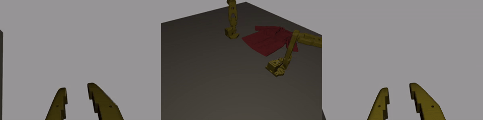

# Folding media status — 20 September 2026

Replacement rendering gate **21367715** was submitted at 17:31 UTC. It is a
single GPU job capped at 30 minutes, not a new training run. It completed all
600 policy actions and 601 validated render calls, with all four GIFs present.
**Rendering passed; this policy episode did not fold the garment.** No existing jobs were cancelled,
released from hold, requeued, or given different dependencies.

## Failure and repair

Gate 21360435 failed before physics or camera capture. LeHome discovered the
containing Git checkout and built a robot path under `lehome-fold-repro/Assets`.
The actual SO101 USD is in the shared `lehome-data/Assets` pack.

The [replacement snapshot](../campaigns/20260920-media-root-fix/README.md)
sets the explicit manifest asset root before LeHome imports, covering robot and
apartment scene references, and binds **both** robot configurations.
Preflight validates the USD, garment references, 132 frozen source/config files,
and every selected checkpoint file hash before GPU startup. The old snapshot
is unchanged. CPU validation passed: 4 asset regressions, 8 camera/episode audit
checks, 3 media pipeline checks, and 51 existing pure checks (66 total).

## Job graph

| Job | Meaning | Status at handoff |
|---|---|---|
| 21360435 | Original gate | Failed: missing robot path; no policy result |
| 21360436 | Original 15-episode array | Preserved; dependency can never be satisfied |
| 21360437 | Original report | Preserved; waits for the original array |
| 21367674 | First replacement | Robot loaded; then failed on the same root bug for the scene |
| 21367715 | Full asset-root replacement | Completed: 600 actions, 601 render calls, four GIFs; fold failed |

A passing replacement does **not** unblock the original array: its dependency
still names 21360435. The remaining episodes need a separate replacement array
if requested after this gate is inspected.

## Media interpretation

The new gate must save overhead, both wrist views and a triptych for one full
600-action adapted-policy episode. Either a valid success or a valid failed fold
can pass this infrastructure check. A crash, timeout or missing view cannot.
The second attempt completed. The unchanged fold checker never passed and the
terminal verdict was also false. This is one illustrative development pose, not
an estimate of policy success rate. No additional GPU array was submitted.

The README's older policy GIF and the four-class demonstration replays are
historical, separate evidence. Their results are not the result of this campaign.
See the [submission receipt](../campaigns/20260920-media-root-fix/gate_submission.json)
and `outputs/<task>/status.json` on the cluster for execution provenance.

## Repository boundaries

This repository owns garment-folding media. `bhl-robustness-ladder` owns humanoid
training and its weekend orchestration, including the selected adaptation
checkpoint paths. `isaac-sim-pruning-workflow` owns the UR5e orchard recordings.
A VS Code active tab is editor context, not a change to the agent's shell cwd.
Always check `pwd` and `git remote -v` before reporting or editing another project.

## New adapted-policy failure recording

[Compact MP4](demo/adapt-s0-failure.mp4) · [Scorer and render audit](evidence/media-gate-2026-09-20/21367715-rollout.json).
The preview preserves the episode timeline; spatial size and frame rate are
reduced for the web. Full-resolution individual camera GIFs remain in the
campaign output directory. The historical success at the top of the README
uses a different checkpoint and garment; it is not a success from this gate.
